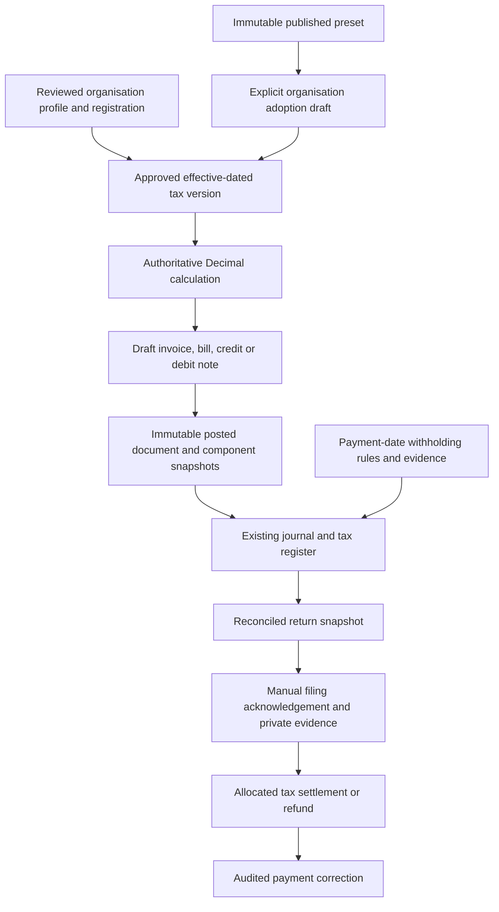

# Phase 4 — jurisdiction tax engine

Local verification date: **14 September 2026**. This report covers the jurisdiction tax-engine request and the additional Ghana statutory-change/override requirements. Earlier Phase 1/2 protections and uncommitted Phase 3 document work are retained.

**Status: implementation verified locally; statutory filing activation remains conditional.** This is not a public-launch approval or a GRA certification. The exact current DT110/ITAS upload template, complete current WHT code schedule and 2026 VAT-withholding transition were not verified. Their statutory activation/upload paths remain unavailable. No claim is made about production data, deployed settings or operational readiness from these local tests.

## 1. Architecture implemented

The existing tax rates, tax transactions, accounts, commercial documents and journal services remain the accounting foundation. New effective-dated configuration resolves into the existing ledger; there is no second accounting ledger.

Jurisdiction/regime/type are represented by profile fields, the global regime catalogue and code family/classification, rather than redundant lookup tables. Components are validated version-owned JSON, with immutable posted line snapshots and relational account mappings. The three structures are `GHANA_GRA`, `CUSTOM_INTERNATIONAL` and `NO_TAX`.

Primary implementation: `accounting-backend/apps/tax/{jurisdiction_models,configuration,engine,document_tax,withholding,returns,operations,api,presets}.py`. Exact symbol/line references are in [the code index](PHASE4_TAX_CODE_INDEX.md).

## 2. Ghana regime version and effective date

The built-in verified VAT preset is **2026.1**, effective **1 January 2026**. Its percentage components use a common taxable base. The immutable global preset is distinct from each organisation's approved applicability windows and account mappings.

A future organisation override can change percentage/fixed components, recoverability, labels and dependency order, including compound treatment when supported by a reviewed future law. It is labelled `ORGANISATION_OVERRIDE`, never Ledgify/GRA verified. The original 2026.1 preset cannot be changed into a compound scheme by editing it.

## 3. Official sources used

Sources were checked on **12 September 2026**. Their scope and retrieval limitations are recorded in [the source register](tax-sources/SOURCES.md).

| Source | Use and limitation |
|---|---|
| [GRA VAT reforms](https://gra.gov.gh/domestic-tax/tax-types/vat/) | 2026 VAT/levy rates, common-base treatment, effective date and input deductibility subject to eligibility. |
| [Notice to VAT-registered taxpayers](https://gra.gov.gh/news/portfolio/notice-to-all-vat-registered-taxpayers/) | Corroborating VAT reform and flat-rate termination notice. |
| [GRA withholding guidance](https://gra.gov.gh/portfolio/withholding-tax/) | Payment trigger, categories and certificates; not a complete versioned current ITAS code/template specification. |
| [GRA 2015 withholding code PDF](https://gra.gov.gh/wp-content/uploads/2020/09/WHT-TAX-CODES_DESCRIPTION-AND-RATES_2015.pdf) | Historical reference only; not installed as a current statutory schedule. |
| [GRA VAT withholding](https://gra.gov.gh/domestic-tax/tax-types/vat-withholding/) | Mentions 7%, but contains older base/levy wording. The 2026 transition remains pending confirmation. |
| [GRA forms](https://gra.gov.gh/forms/) | DT110 listing did not establish exact current accepted upload columns/codes. |
| [GRA corporate income tax](https://gra.gov.gh/domestic-tax/tax-types/corporate-income-tax/) | Circumstances vary; no universal CIT calculation was introduced. |
| [GRA E-VAT](https://gra.gov.gh/e-services/e-vat/) | Official onboarding boundary; no certification inferred. |

A linked 2026 administrative guideline PDF could not be read because of the site's verification page/network timeout. It is not cited as evidence for implemented treatment. No portal login, unofficial endpoint or automated submission was used.

## 4. Statutory rates activated

Activation is an organisation action after registration, mapping, review and confirmation; no existing production organisation was activated.

| Eligible standard-rated transaction | Rate | Exclusive base 1,000 |
|---|---:|---:|
| VAT | 15% | 150.00 |
| NHIL | 2.5% | 25.00 |
| GETFund | 2.5% | 25.00 |
| Combined charge | 20% | 200.00 |

Registered Ghana synthetic organisations activate standard sales/purchase codes. Zero-rated, exempt and out-of-scope codes retain distinct classifications and reasons; all have zero charged tax. Non-VAT-registered Ghana organisations do not receive active standard VAT merely because their country is Ghana.

## 5. Rates left pending verification

- Complete statutory resident/nonresident WHT rates and current portal codes.
- Statutory 2026 VAT-withholding rate/base transition; the public 7% mention is not silently activated.
- Special Ghana import/digital treatments where the full applicable rules were not verified.
- CIT, PAYE, SSNIT, rent, CST, excise, customs, capital-gains and other unsupported statutory computations.
- Automatically seeded statutory filing/payment deadlines without a verified effective rule.

An authorised organisation user may enter an explicitly verified, sourced, effective-dated WHT rule, obtain approval and activate it. This is an organisation override. Synthetic test rates demonstrate mechanics only and are not published statutory presets.

## 6. Ghana WHT codes implemented

The catalogue contains resident and nonresident variants for goods, services, works, rent, interest, dividends, royalties, commissions, management/technical services and other withholding. These are internal category identifiers, not invented current GRA accepted upload codes. `GHS-VAT-WHT` is a separate family.

Payment snapshots retain residence, tax identifier, country, official code entered by the reviewer, contract/gross/base/withheld/net amounts, rate, source, certificate, payment date, currency and treatment metadata. VAT-withholding eligibility requires the relevant appointment/transaction confirmation. Customer withholding recovery requires certificate/reference support; VAT-withholding certificate dates are explicit.

Both source-payment reversal and tax-remittance correction are atomic. They preserve original records and create dated opposite journals. Registers project original/reversal events separately.

## 7. Custom/international capabilities

The builder supports percentage and fixed-per-unit components, independent/compound calculation, input recoverability, separate controls, inclusive/exclusive defaults, classification, source, effective windows, reporting groups, required contact tax identifiers and filing frequency. Custom countries do not receive the Ghana catalogue automatically.

Validation rejects duplicate components, negative/nonfinite/excessive values, cycles, self/forward dependencies, foreign/inappropriate controls, overlapping windows, unapproved applicability and destructive changes to used configuration. Maximum rates are profile-configurable; unusually high rates require explicit confirmation.

Supported tax points are invoice date for indirect tax and payment date for withholding. Supply-date and other tax points, cash-basis VAT accounting, arbitrary rounding schemes and universal statutory payroll are not advertised as supported. The Phase 2 two-decimal HALF_UP policy remains in effect. Tax settlement currently uses a base-currency bank account; commercial documents retain transaction/base currency and original FX rates.

## 8. Organisation-selection and change workflow

1. Select structure and jurisdiction, effective date and migration reason.
2. Explicitly declare registrations, identifiers, effective/deregistration dates, obligations and reporting basis/frequency.
3. Map existing controls or explicitly create only missing controls.
4. Save a draft profile, review it and separately confirm activation. Where separation of duties is enabled, a different authorised reviewer is required.
5. Future changes create new versions. Review old/new backend calculations and affected drafts, approve, then activate/schedule.
6. Posted history remains unchanged. A stale draft must be refreshed before posting. Backdated activation over existing effective ledger entries is rejected.

The settings page provides numbered setup/review sections, rather than silently migrating on country selection. Existing organisations without a profile retain legacy accounting until a reviewed migration is performed; this compatibility is not an assertion that their historic classification is correct.

Published presets are visible in Tax Settings. The user can compare current/proposed components and totals, see override conflicts/source/effective date, keep the current version, create an adoption draft or schedule it. Adoption preserves valid mappings and needs subsequent approval/activation. “Contact accountant” supplies review guidance and does not send a message. Preset/reminder notices are in-app; no outbound notification worker was introduced.

The `publish_ghana_tax_preset` management command validates by default. Publication requires an active platform staff reviewer, official HTTPS GRA source, explicit verification, checked date, review note and `--publish`. It never adopts the preset for organisations.

## 9. Calculation and journal examples

The verified common-base exclusive invoice for GHS 1,000 posts:

| Account | Debit | Credit |
|---|---:|---:|
| Receivables | 1,200.00 | — |
| Sales | — | 1,000.00 |
| Output VAT | — | 150.00 |
| Output NHIL | — | 25.00 |
| Output GETFund | — | 25.00 |

An inclusive 1,200 produces net 1,000 and the same components. Each line/component uses Decimal HALF_UP; any inclusive-cent residual is assigned explicitly so net plus components equals gross.

A fully recoverable purchase debits expense 1,000 and separate input controls 150/25/25, and credits payables 1,200. Partial/nonrecoverable amounts go to cost; reverse-charge purchases self-assess controls without increasing the supplier's amount due.

A **synthetic, nonstatutory** supplier fixture with ordinary withholding 60 and VAT withholding 70 settles AP 1,200, credits bank 1,070 and credits the two distinct withholding controls. Customer withholding debits bank and withholding receivable against gross AR. Neither family changes invoice VAT.

A USD 1,200 invoice at stored 12.5 GHS/USD posts base AR 15,000 and base tax 2,500. Its later reversal retains that rate and tax snapshot even after a future VAT change. Linked credits/debits likewise use original line snapshots. Debit notes reuse existing invoice/bill posting/settlement services with explicit original-document metadata.

## 10. Returns, evidence, exports and calendar

VAT workpapers include separate standard/zero/exempt/out-of-scope bases, output/input components, imports, nonrecoverable inputs, credit/debit adjustments, VAT-withholding credits, approved adjustments and net payable/refundable. Source links and journal references support review. Tax registers and mapped GL controls must reconcile before review/approval.

Approved snapshots cannot be rewritten. Filing requires an actual acknowledgement. Uploads are private PDF/PNG/JPEG evidence bounded to 5 MB, served through organisation-scoped authenticated download endpoints. Export is not filing. Later corrections use open-period adjustments or a separate amendment revision. Amendments cannot duplicate prior settlements.

Settlement requires reviewed control allocations whose signed total equals bank cash. Final settlement clears all output/input/credit controls. Refunds use negative cash; zero-cash netting creates no artificial bank line. Idempotency keys prevent duplicate adjustment/payment requests. The dedicated remittance-correction workflow reverses all allocations and restores unsettled status without changing the filed calculation or acknowledgement; generic journal reversal stays blocked. It records accounting only, not a bank/GRA cancellation.

**Available exports:** reviewed JSON workpaper, readable PDF workpaper and a validated, formula-escaped internal WHT review CSV with checksum/template metadata and GL reconciliation. **Unavailable:** a file claimed to match the current GRA DT110/ITAS upload schema. The internal file is labelled `NOT_GRA_UPLOAD`; requests for portal-ready export fail explicitly. WHT reversal rows require reviewed official amendment treatment before CSV export.

Other obligations are tracking-only: registration, source/versioned manual calendar periods/deadlines, responsible member, in-app reminder offsets, acknowledgement/payment references and private documents. Generic Ghana payroll calculations/posting are blocked. Entering an external calendar payment reference does not create a ledger payment.

## 11. Models and migrations

New entities include `TaxRegimeVersion`, `OrganisationTaxProfile`, `OrganisationTaxRegistration`, `TaxCode`, `TaxRateVersion`, `TaxApplicabilityRule`, `TaxAccountMapping`, `DocumentTaxSnapshot`, `DocumentLineTaxSnapshot`, `TaxConfigurationAudit`, `TaxReturnDraft`, `TaxFilingEvidence`, `TaxAdjustment`, `TaxPayment`, `WithholdingTransaction`, `TaxExport`, `TaxCalendarEntry`, `TaxClassification` and reserved `EvatCertification` fields.

| Migration | Purpose |
|---|---|
| organisations `0008` | Structure selection/configuration version. |
| sales/purchases `0015` | Commercial line tax snapshots. |
| sales/purchases `0016` | Rate precision. |
| tax `0002` | Versioned models, snapshots and metadata. |
| tax `0003` | PostgreSQL tenant/history/period guards and nonoverlapping applicability windows. |
| tax `0004` | Legacy bridge rate precision. |
| tax `0005` | Used-code immutability and approved-return reopen protection. |
| tax `0006` | Adjustment/payment request-key uniqueness and payload checksums. |

Earlier uncommitted Phase 3 organisation `0007` and sales `0014` migrations remain dependencies. PostgreSQL and `btree_gist` are required for the claimed database constraints; SQLite is not equivalent verification. Migrations were applied only to disposable local databases. Ambiguous historic data must be reviewed before applying constraints; failed migrations must not be bypassed by deleting financial history.

## 12. Files changed

See [the code index and workspace inventory](PHASE4_TAX_CODE_INDEX.md). It distinguishes principal tax files from the complete current worktree inventory. The latter includes preserved Phase 3 work and must not be attributed wholly to this phase.

Tax integration also touches sales/purchases approval/payment/credit services and serializers, bank matching, shared documents, permissions, payroll guards, API routing, flags and transaction editors. Existing PDF/email changes from Phase 3 were extended to display frozen tax components and registration identifiers.

## 13. Tests and exact results

Final command results are recorded in [the verification record](PHASE4_TAX_VERIFICATION.md). Verification uses local PostgreSQL 16 and Redis 8.2.1, with no production service access and an in-memory email backend for browser work. Backend bytecode writing was disabled to preserve tracked bytecode.

Tests cover common-base/inclusive math, classification distinctions, recovery and reverse charge, source credits/debits/reversals, date boundaries, stale drafts, immutable snapshots, currency conversion, withholding/certificates, reconciled returns, filed locks/amendments, payment/refund/zero-cash settlement, remittance correction, replay protection, preset publication/adoption, tenant checks, emergency role restrictions and PostgreSQL concurrency.

This does not imply every browser permutation or every role/action combination was exhaustively exercised. No official portal acceptance test or deployed-environment test was possible or claimed.

## 14. Existing-data migration risks

The read-only audit checks missing profiles, legacy/conflicting Ghana rates, post-reform flat rates, missing posted snapshots, mappings, overlaps and tax-register/GL differences. On three synthetic organisations it reported no findings; a read-only PostgreSQL transaction and before/after hashes of 119 model tables confirmed no writes.

**No real-customer audit was run.** Posted legacy rows missing classification/version evidence must be reviewed, not automatically recalculated. Migrating an existing organisation can leave old drafts requiring explicit tax-code confirmation. Legacy quotation/order conversion must be reviewed when a configured profile requires explicit tax classification; this phase does not silently infer tax codes from old numeric rates. Pilot these conversions and refresh/re-enter reviewed lines before enabling them for migrated organisations.

Before any production migration: restore a recent backup into isolated staging, run the read-only audit, resolve ownership/mapping/overlap discrepancies with an accountant, apply migrations, rerun reconciliation and exercise historic reversals. Retain an approved restoration plan and do not treat a synthetic clean audit as evidence about production.

## 15. Manual accountant/GRA verification still required

| Required action | Verification / acceptance evidence |
|---|---|
| Confirm each organisation's registration and obligations | Accountant reviews identifiers, effective dates, recoverability, tax point, mappings and selected obligations before profile approval. |
| Supply exact current DT110/ITAS specification | Record official source/version/checksum, accepted codes, columns, date/number/encoding rules and reversal treatment; add a separately reviewed adapter and compare representative files with the official template before enabling portal export. |
| Confirm current WHT/VAT-WHT schedules | Verify effective dates, bases, designation, thresholds/exemptions/DTA evidence and certificates; approve sourced versions. Pending catalogue rows must remain inactive until then. |
| Confirm special Ghana treatments and deadlines | Obtain current official rules and accountant sign-off; retain tracking-only labels for unsupported calculations. |
| Pilot existing-data migration and commercial conversion | Staging audit has explained/resolved findings; old posted snapshots/totals stay identical; reviewed new documents post balanced journals and reconcile. |
| Production-scale review | Measure register/workpaper queries, history/catalogue response sizes, evidence storage, retention and backups using representative staging volumes. Current local runs are small synthetic fixtures. |
| Operational launch review | Recheck deployment flags, HTTPS, cache/mail services, monitoring, restore drills, privacy/terms and commercial subscription readiness. This tax implementation does not certify those earlier launch areas. |

## 16. GRA E-VAT remains disabled

`ENABLE_GRA_EVAT=false` and `VITE_ENABLE_GRA_EVAT=false` are documented defaults. Only a disabled connector protocol/credential-vault boundary and reserved immutable certification fields exist. No credential-entry API or credential store has been activated, and no GRA request is sent. A real encrypted, scoped, rotatable backend vault remains part of the future authorised integration, not a claimed working service today.

Official documentation, sandbox credentials, encryption/key management, response authenticity, retry/offline/cancellation testing and GRA sign-off are prerequisites for activation.

## 17. No certification claim

No fabricated receipt ID, signature, QR verification payload or certificate was generated. Invoice/PDF output shows ordinary organisation identity and separate tax components. It does not label Ledgify or the invoice GRA certified. Unfinished AI remains disabled and its direct route was checked in the browser.

## 18. No push, deployment or production-data change

No commit, push, merge or deployment was performed. Existing user changes were preserved. Migrations, synthetic records, payments, corrections and browser actions were limited to disposable local verification databases. Browser email used Django's in-memory backend; no customer email, tax submission, bank payment or external message was sent.

## Go-live gates for this phase

- [ ] Accountant approves registration, treatment, controls and effective dates per pilot organisation.
- [ ] Staging audit and restored-data migration pass with historic balances/snapshots preserved.
- [ ] Pilot invoice/bill/credit/debit/payment/refund/reversal and quotation/order conversions are accepted.
- [ ] Reviewed VAT/WHT workpapers reconcile and evidence is retrievable across permitted roles only.
- [ ] Exact current official WHT upload specification is verified before enabling a portal-ready adapter.
- [ ] Pending statutory rules remain inactive; unsupported obligations remain tracking-only.
- [ ] E-VAT and unfinished AI remain disabled unless separately authorised, implemented and verified.
- [ ] Monitoring, backup/restore, privacy/terms and commercial launch requirements are signed off separately.
- [ ] Production migration/deployment is explicitly scheduled after review; nothing in this local phase deployed it.
